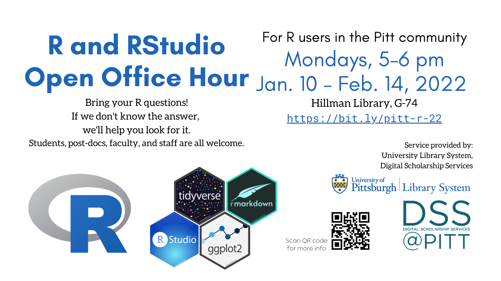

When: **Mondays, 5-6pm**, starting January 10 (except 1/17 and 2/21)

Where: **Online** through Jan. 26 ([zoom link](https://pitt.zoom.us/j/97200939890)); then Hillman Library, G-74 (Amy Knapp Room; straight back on the Ground Floor)

Users of R and RStudio are invited to bring their questions to this weekly in-person office hour. Tutoring-style assistance is offered. If we don’t know the answer, we’ll help you look for it! Students, postdocs, faculty, and staff are welcome.

Topics we can help with include:

* general R and RStudio questions; help getting started
* troubleshooting an error or bug in your code
* data wrangling, i.e., cleaning and manipulation, using dplyr and tidyr (tidyverse)
* data exploration and analysis using dplyr (tidyverse)
* data visualization using ggplot2 (tidyverse)
* general programming questions/advice as they relate to R
* (this is a growing list!)

What you should bring: your laptop and your question/problem.

This service is provided free of charge for the Pitt community by the [University Library System](https://library.pitt.edu/), [Digital Scholarship Services](https://library.pitt.edu/digital-scholarship-services/). For questions, contact the Library [here](https://library.pitt.edu/ask-us). 

-------

## The r-lessons-learned repository

An associated code repository accompanies this office hour for future reference. You can access it here: [https://github.com/dojobo/r-lessons-learned/](https://github.com/dojobo/r-lessons-learned/).
